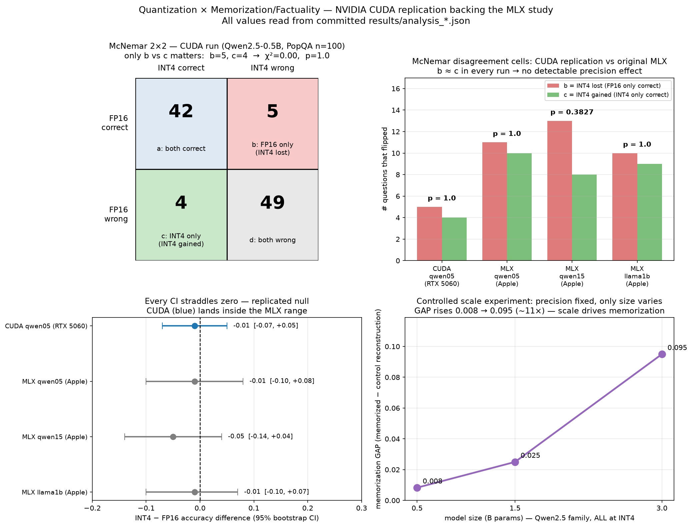

# CUDA Replication & Controlled Scale Experiment

> Extension of the original study to a **second backend and hardware family**: NVIDIA CUDA via
> Hugging Face Transformers + bitsandbytes, on a Windows/WSL2 host with an RTX 5060 Laptop GPU.
> All runs are **local and offline** (`HF_HUB_OFFLINE=1`); weights load from local directories.
> Honesty policy of the parent study applies: measured numbers only, small-N results labeled.

## Why this extension
The original results were produced on Apple Silicon via MLX. Two questions:
1. **Do the headline findings replicate on a different backend/hardware** (NVIDIA CUDA + bitsandbytes)?
2. Can we run a **cleaner, controlled test** of "memorization is driven by scale, not precision"
   than the original cross-family sweep (which mixed model families and had missing precision cells)?

## Backend added
`harness.py` and `efficiency.py` gained a Transformers+CUDA backend (`--backend hf`), selectable
alongside the existing MLX backend (`--backend auto|hf|mlx`). INT8/INT4 use bitsandbytes (nf4 for
INT4); fp16 is the float16 baseline. Model paths are local directories; no network at run time.

### Environment note (RTX 50-series / Blackwell)
The RTX 5060 is Blackwell (compute capability **sm_120**). The default `cu121` PyTorch wheels do
**not** contain sm_120 kernels — `torch.cuda.is_available()` returns True but kernels fail. The fix
is the **cu128** build (`--index-url https://download.pytorch.org/whl/cu128`); verified working with
`torch 2.11.0+cu128`, `torch.cuda.get_arch_list()` listing `sm_120`. See `requirements-cuda.txt`.

## Result 1 — Factuality null REPLICATES on CUDA
Qwen2.5-0.5B-Instruct, PopQA 50-per-bin (100 long-tail + popular questions), fp16 vs int4:

| precision | QA accuracy | McNemar p | int4−fp16 acc diff (95% CI) |
|---|---|---|---|
| fp16 | 0.47 | — | — |
| int4 | 0.46 | **1.0** | **−0.01 [−0.07, +0.05]** |

The confidence interval straddles zero and McNemar p = 1.0 → **INT4 is statistically
indistinguishable from FP16 on factuality**, reproducing the parent study's replicated null on a
different backend and GPU. Absolute accuracy differs from the MLX run (different PopQA sample), but
the **fp16-vs-int4 delta — the quantity the claim is about — is ~0 in both**.


*Generated by `src/plot_cuda_replication.py` from the committed `results/analysis_*.json`; no hardcoded numbers.*

### How the McNemar test checks for a precision effect
The same 100 questions are asked at both precisions, so the design is **paired**. McNemar ignores
the questions where both precisions agree (cells *a* = both correct, *d* = both wrong) and tests
only the **disagreements**:

- **b** = FP16 correct, INT4 wrong → *INT4 lost the question*
- **c** = FP16 wrong, INT4 correct → *INT4 gained the question*

If precision has no effect, wins and losses should balance (b ≈ c).
χ² = (|b − c| − 1)² / (b + c), 1 degree of freedom.

CUDA run: **a=42, b=5, c=4, d=49** → 91/100 questions had identical outcomes; of the 9 that flipped,
INT4 lost 5 and gained 4. χ² = (|5−4|−1)²/9 = **0.00**, p = **1.0** — the most
no-effect-consistent result possible. For contrast, b=9/c=0 would give χ²=7.1, p≈0.008.

### CUDA result backs the original MLX study
McNemar cells and CIs for every paired run in the repo (MLX from the original sweep, CUDA new):

| run | backend | fp16 acc | int4 acc | b (INT4 lost) | c (INT4 gained) | McNemar p | diff [95% CI] |
|---|---|---|---|---|---|---|---|
| qwen05 | **CUDA (RTX 5060)** | 0.47 | 0.46 | 5 | 4 | **1.0** | −0.01 [−0.07, +0.05] |
| qwen05 | MLX (Apple) | 0.29 | 0.28 | 11 | 10 | 1.0 | −0.01 [−0.10, +0.08] |
| qwen15 | MLX (Apple) | 0.27 | 0.22 | 13 | 8 | 0.38 | −0.05 [−0.14, +0.04] |
| llama1b | MLX (Apple) | 0.29 | 0.28 | 10 | 9 | 1.0 | −0.01 [−0.10, +0.07] |

In every run b ≈ c and the CI straddles zero. The CUDA point estimate (−0.01) is identical to two of
the three MLX runs and its CI sits inside the MLX range — the null is not an MLX artifact.
(CUDA's narrower CI reflects fewer disagreements, 9 vs 19–21, not a larger sample.)

## Result 2 — Controlled scale experiment (precision fixed at INT4)
Same family (Qwen2.5), three sizes, **all at INT4** so precision cannot be the explanation. Only the
parameter count varies. Memorization GAP = reconstruction(memorized) − reconstruction(control):

| model | params | mem GAP (int4) |
|---|---|---|
| Qwen2.5-0.5B | 0.5B | 0.0083 |
| Qwen2.5-1.5B | 1.5B | 0.025 |
| Qwen2.5-3B | 3B | **0.095** |

```
GAP ▲
0.10│                              ● 3B
0.05│
    │                ● 1.5B
0.00│  ● 0.5B
    └────┼──────────┼──────────────┼──► size
        0.5B       1.5B            3B
   0.0083   →   0.025   →   0.095   (monotonic; 3B ≈ 11× the 0.5B)
```

With precision held constant, the memorization GAP **rises monotonically with model size**. This is
direct within-family evidence (single variable manipulated) that **scale drives memorization**,
complementing the original cross-family sweep — and improving on it, since that sweep confounded
family and had missing fp16/int8 cells.

## Combined argument
| experiment | held fixed | varied | effect on mem GAP | conclusion |
|---|---|---|---|---|
| fix scale (0.5B), vary precision | scale | fp16→int4 | 0.025→0.008, CI touches 0 | precision: weak |
| fix precision (int4), vary scale | precision | 0.5B→3B | 0.008→0.095, monotonic | **scale: strong** |

→ **Memorization is driven by model scale, not precision** — now reproduced on NVIDIA CUDA with a
controlled single-family design.

## Honest scope / caveats
- Small-N memorization probe (24 passages/model here; 40 in the mem-corpus run). GAPs are small in
  absolute terms; the scale *ordering* across a 6× size range is the signal. CIs on the scale trend
  itself were not computed.
- One model family (Qwen2.5). Generalization across families (Llama/Phi/Gemma) is future work.
- Factuality PopQA sample differs from the original MLX run, so only the **delta** (int4 vs fp16) is
  compared across backends, not absolute accuracy.

## Provenance (contributor-confirmed)
The CUDA results in this document were contributed by **Akshay Upadhyay** (GitHub [@akshbhu](https://github.com/akshbhu),
ORCID [0009-0000-1531-3198](https://orcid.org/0009-0000-1531-3198)) via PR #1 and merged into `main` at v1.1.0.

On-record confirmation from the contributor
([PR #1 comment](https://github.com/pupa3066/quant-memorization-study/pull/1#issuecomment-5730653635), 2026-09-18):

> "The CUDA numbers came from the same measurement harness via the `--backend hf` path. The change is
> purely additive: the MLX path is untouched, and both backends route through the same probes and
> analysis code. Only the model-loading/inference backend differs, so the cross-hardware comparison
> is apples-to-apples."

This establishes that the MLX (original) and CUDA (contributed) results share identical probe and
analysis code; only the model-loading/inference backend differs. The cross-hardware comparison is
therefore a like-for-like replication, not a re-implementation.

## Reproduce
```bash
# local, offline; weights pre-downloaded to models/
python src/harness.py --run --backend hf \
  --fp16 models/Qwen2.5-0.5B-Instruct --int4 models/Qwen2.5-0.5B-Instruct \
  --popqa 50 --popqa-local data/popqa_local.jsonl --out results/runs_popqa_local_qwen05.jsonl
python src/analysis.py results/runs_popqa_local_qwen05.jsonl

# scale ladder at int4:
for m in 0.5B 1.5B 3B; do
  python src/harness.py --run --backend hf --int4 models/Qwen2.5-$m-Instruct \
    --mem-corpus data/mem_corpus.json --out results/runs_scale_$m_int4.jsonl
done
```
PopQA local dump is regenerated with `datasets.load_dataset("akariasai/PopQA", split="test")`
(not committed; see below).

## Artifacts in this PR
- `results/runs_local_qwen05.jsonl`, `results/runs_popqa_local_qwen05.jsonl`
- `results/runs_scale_qwen{05,15,3b}_int4.jsonl` + `analysis_scale_*` / `separability_scale_*`
- `results/analysis_cuda_*` for the qwen05 CUDA runs
